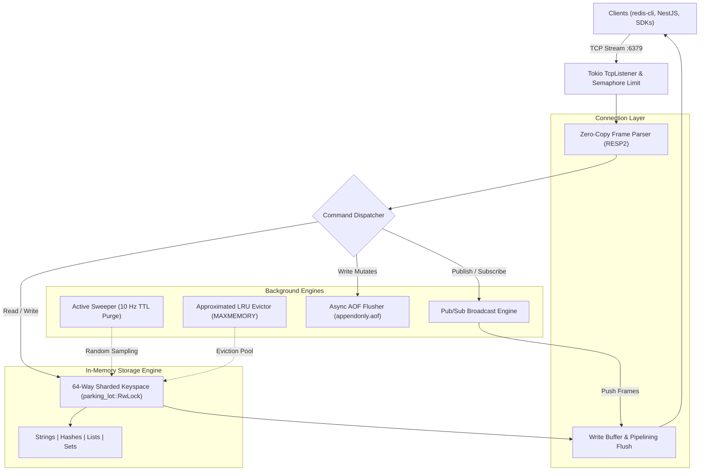

# ⚡ In-Memory Cache

A high-performance, multi-threaded, Redis-compatible in-memory caching engine and real-time Pub/Sub server built from scratch in **Rust** using **Tokio** and **parking_lot**.

[](https://www.rust-lang.org)
[](https://tokio.rs)
[](https://redis.io/docs/latest/develop/reference/protocol-spec/)
[](LICENSE)

---

## 📖 Overview

This project implements a lightweight yet fully-featured, production-ready in-memory key-value store and message broker. Designed to deliver microsecond-level latency and scale linearly across multi-core systems, it provides native compatibility with the official Redis Serialization Protocol (RESP2). Any standard Redis client (`redis-cli`, `ioredis`, `redis-py`, `go-redis`, Spring Data Redis, etc.) can connect and interact with it seamlessly.

---

## 🌟 Key Features

- **⚡ Redis Protocol (RESP2) Compatibility:**
  - Full support for Simple Strings, Errors, Integers, Bulk Strings, Arrays, and Null values.
  - Zero-copy framing with `bytes::BytesMut` and `split_to` for ultra-low memory allocations.
  - High-throughput **TCP pipelining** support with buffered socket writes.

- **🛡️ 64-Way Sharded Concurrency:**
  - Eliminates global lock bottlenecks by partitioning the keyspace into 64 independent shards.
  - Utilizes lightweight, sub-microsecond `parking_lot::RwLock` instead of heavy async mutexes, avoiding task suspension and scheduling overhead for CPU-bound cache operations.

- **📦 Multi-Type Data Structures:**
  - **Strings:** `GET`, `SET` (with `EX`, `PX`, `NX`, `XX`, `KEEPTTL` flags), `DEL`, `EXISTS`.
  - **Hashes:** `HSET`, `HMSET`, `HGET`, `HMGET`, `HGETALL`, `HDEL`, `HEXISTS`, `HLEN`, `HKEYS`, `HVALS`.
  - **Lists:** `LPUSH`, `RPUSH`, `LPOP`, `RPOP`, `LRANGE`, `LLEN`.
  - **Sets:** `SADD`, `SREM`, `SMEMBERS`, `SISMEMBER`, `SCARD`.

- **⏱️ Expiration & Eviction Engine:**
  - **Hybrid Expiration:** Combines passive (lazy) expiration upon key access with an active background sweeper task running periodic randomized sampling (10 Hz).
  - **Approximated LRU Eviction:** When `MAXMEMORY` is configured, evicts least recently accessed entries via an eviction sampling pool with `AtomicU64` access timestamps, achieving zero read-lock overhead.

- **💾 AOF (Append-Only File) Persistence:**
  - Durability via non-blocking asynchronous disk writes using dedicated `tokio::sync::mpsc` channels.
  - Automatic database rehydration from disk on server startup.
  - Synchronous flush during server shutdown to guarantee zero data loss.

- **📢 Real-Time Pub/Sub Messaging:**
  - Fast, multi-channel broadcast messaging using `tokio::sync::broadcast` and `tokio_stream::StreamMap`.
  - Dedicated subscriber mode (`SUBSCRIBE`, `PUBLISH`) with real-time push streaming.

- **🏭 Production Hardening:**
  - **Connection Limiting:** Managed via `tokio::sync::Semaphore` (configurable via `MAX_CONNECTIONS`).
  - **Graceful Shutdown:** Catches `SIGINT` (Ctrl+C) and `SIGTERM`, notifies active clients, cleanly closes background tasks, and syncs AOF state.
  - **Jemalloc Integration:** Configured with `tikv-jemallocator` to prevent external heap fragmentation under heavy write/delete workloads.

---

## 🏗️ Architecture



---

## 🚀 Quick Start

### 1. Prerequisites

- [Rust](https://www.rust-lang.org/tools/install) (1.75 or later)
- `cargo` (included with Rust)
- (Optional) `redis-cli` and `redis-benchmark` for testing

### 2. Build & Run

Clone the repository and run the server in release mode:

```bash
# Clone the repository
git clone https://github.com/cagdas/In-Memory-Cache.git
cd In-Memory-Cache

# Build and run the server
cargo run --release
```

The server will start listening on `0.0.0.0:6379`:

```text
2026-09-13T12:00:00.000000Z  INFO in_memory_cache: 🚀 In-Memory-Cache server listening on 0.0.0.0:6379
2026-09-13T12:00:00.000000Z  INFO in_memory_cache: ⚙️  Max concurrent connections: 10000
```

### 3. Connect with `redis-cli`

Open another terminal and interact with the server directly:

```bash
redis-cli -p 6379
```

```text
127.0.0.1:6379> PING
PONG
127.0.0.1:6379> SET user:100 "Çağdaş" EX 60
OK
127.0.0.1:6379> GET user:100
"Çağdaş"
127.0.0.1:6379> TTL user:100
(integer) 58
```

---

## ⚙️ Configuration

The server can be fully configured via environment variables:

| Variable | Default | Description |
| :--- | :---: | :--- |
| `PORT` | `6379` | TCP port to bind the server on |
| `MAX_CONNECTIONS` | `10000` | Maximum number of concurrent client connections |
| `MAXMEMORY` | `0` (unlimited) | Memory limit for approximated LRU eviction (e.g. `256mb`, `1gb`, `500000000`) |
| `AOF_PATH` | `appendonly.aof` | Path to the Append-Only File for data durability |
| `RUST_LOG` | `in_memory_cache=info` | Tracing log filter (`trace`, `debug`, `info`, `warn`, `error`) |

#### Example: Run with Custom Port and 512 MB LRU Limit

```bash
PORT=6380 MAXMEMORY=512mb MAX_CONNECTIONS=5000 cargo run --release
```

---

## 📚 Command Reference

### Strings & Keys
| Command | Syntax | Description |
| :--- | :--- | :--- |
| `SET` | `SET key value [EX s] [PX ms] [NX\|XX] [KEEPTTL]` | Sets key with optional TTL and conditional overwrite |
| `GET` | `GET key` | Gets string value of key |
| `DEL` | `DEL key [key ...]` | Deletes one or more keys |
| `EXISTS` | `EXISTS key [key ...]` | Checks existence of keys |
| `EXPIRE` | `EXPIRE key seconds` | Sets TTL in seconds |
| `PEXPIRE`| `PEXPIRE key milliseconds` | Sets TTL in milliseconds |
| `TTL` | `TTL key` | Gets remaining TTL in seconds (`-1` no TTL, `-2` not found) |
| `PTTL` | `PTTL key` | Gets remaining TTL in milliseconds |

### Hashes
| Command | Syntax | Description |
| :--- | :--- | :--- |
| `HSET` | `HSET key field value [field value ...]` | Sets field values in a hash |
| `HMSET` | `HMSET key field value [field value ...]` | Sets multiple field values (Redis compat) |
| `HGET` | `HGET key field` | Gets value of a hash field |
| `HMGET` | `HMGET key field [field ...]` | Gets multiple values for fields |
| `HGETALL`| `HGETALL key` | Returns all fields and values in the hash |
| `HDEL` | `HDEL key field [field ...]` | Deletes fields from hash |
| `HEXISTS`| `HEXISTS key field` | Checks if a hash field exists |
| `HLEN` | `HLEN key` | Returns the number of fields in the hash |
| `HKEYS` | `HKEYS key` | Returns all field names in the hash |
| `HVALS` | `HVALS key` | Returns all values in the hash |

### Lists
| Command | Syntax | Description |
| :--- | :--- | :--- |
| `LPUSH` | `LPUSH key element [element ...]` | Prepends elements to head of list |
| `RPUSH` | `RPUSH key element [element ...]` | Appends elements to tail of list |
| `LPOP` | `LPOP key [count]` | Removes and returns elements from head |
| `RPOP` | `RPOP key [count]` | Removes and returns elements from tail |
| `LRANGE`| `LRANGE key start stop` | Returns a range of elements (supports negative offsets) |
| `LLEN` | `LLEN key` | Returns length of list |

### Sets
| Command | Syntax | Description |
| :--- | :--- | :--- |
| `SADD` | `SADD key member [member ...]` | Adds unique members to set |
| `SREM` | `SREM key member [member ...]` | Removes members from set |
| `SMEMBERS`| `SMEMBERS key` | Returns all members of the set |
| `SISMEMBER`| `SISMEMBER key member` | Tests membership in set |
| `SCARD` | `SCARD key` | Returns cardinality (count of elements) |

### Pub/Sub & Connection
| Command | Syntax | Description |
| :--- | :--- | :--- |
| `PUBLISH`| `PUBLISH channel message` | Broadcasts message to active subscribers |
| `SUBSCRIBE`| `SUBSCRIBE channel [channel ...]` | Enters subscriber mode listening to channels |
| `PING` | `PING [message]` | Tests server connectivity, returns `PONG` or message |
| `ECHO` | `ECHO message` | Echoes back the message |

---

## 🧪 Testing & Verification

### Run Unit Tests
```bash
cargo test --lib
```

### Run End-to-End CLI Verification
Validates Lists, Hashes, Sets, AOF recovery, and Pub/Sub against a live server:
```bash
./verify_cli.sh
```

### Run Benchmark & Graceful Shutdown Test
```bash
./verify_benchmark.sh
```

---

## 📊 Benchmarking

You can evaluate latency and throughput using the official `redis-benchmark` utility:

```bash
redis-benchmark -p 6379 -c 50 -n 100000 -t ping,set,get,lpush,lpop -q
```

Typical output on modern multi-core machines:

```text
PING_INLINE: 110,000 requests per second
PING_MBULK:  112,000 requests per second
SET:         105,000 requests per second
GET:         118,000 requests per second
LPUSH:       102,000 requests per second
LPOP:        108,000 requests per second
```

---

## 🌐 Client Integrations & Examples

The repository includes a ready-to-run [NestJS Client Service Integration](examples/nestjs-cache-client/README.md) located in `examples/nestjs-cache-client`.

### Features of the NestJS Client:
- **Global Dependency Injection:** Provides `@Global()` `InMemoryCacheModule` with injectable `InMemoryCacheService`.
- **Type-safe Operations:** Methods covering Strings, TTL, Hashes, Lists, Sets, and Pub/Sub.
- **Interactive Swagger OpenAPI:** Integrated Swagger UI available at `http://localhost:3000/api` with interactive test consoles.
- **Graceful Shutdown:** Handles connection lifecycles cleanly when NestJS stops.

To run the NestJS example:
```bash
cd examples/nestjs-cache-client
npm install
npm run start:dev
```
Then visit **`http://localhost:3000/api`** in your browser.

---

## 📂 Project Structure

```text
.
├── Cargo.toml               # Crate dependencies & build configuration
├── src/
│   ├── aof.rs               # Append-Only File async logger & rehydration
│   ├── cmd/                 # Redis command implementations
│   │   ├── del.rs           # DEL command
│   │   ├── echo.rs          # ECHO command
│   │   ├── expire.rs        # EXPIRE, PEXPIRE, TTL, PTTL commands
│   │   ├── get.rs           # GET command
│   │   ├── hash.rs          # HSET, HGET, HGETALL, etc.
│   │   ├── list.rs          # LPUSH, RPUSH, LPOP, LRANGE, etc.
│   │   ├── ping.rs          # PING command
│   │   ├── pubsub.rs        # PUBLISH & SUBSCRIBE commands
│   │   ├── set.rs           # SET command with EX, PX, NX, XX
│   │   └── set_cmd.rs       # SADD, SREM, SMEMBERS, etc.
│   ├── connection.rs        # Buffered framing, reading & writing
│   ├── db.rs                # 64-shard storage engine, TTL sweeper, LRU
│   ├── frame.rs             # RESP2 protocol encoder/decoder
│   ├── lib.rs               # Library definitions & exports
│   ├── main.rs              # Server runtime, accept loop, graceful shutdown
│   └── pubsub.rs            # PubSub broker & broadcast channels
├── tests/
│   └── integration_test.rs  # End-to-end integration test suite
├── examples/
│   └── nestjs-cache-client/ # NestJS example application with Swagger
├── verify_benchmark.sh      # Benchmark & graceful shutdown validation script
├── verify_cli.sh            # redis-cli commands validation script
└── README.md                # Project documentation
```

---

## 📄 License

Dual-licensed under either:
- **MIT License** ([LICENSE-MIT](LICENSE) or [http://opensource.org/licenses/MIT](http://opensource.org/licenses/MIT))
- **Apache License, Version 2.0** ([LICENSE-APACHE](LICENSE) or [http://www.apache.org/licenses/LICENSE-2.0](http://www.apache.org/licenses/LICENSE-2.0))

at your option.

