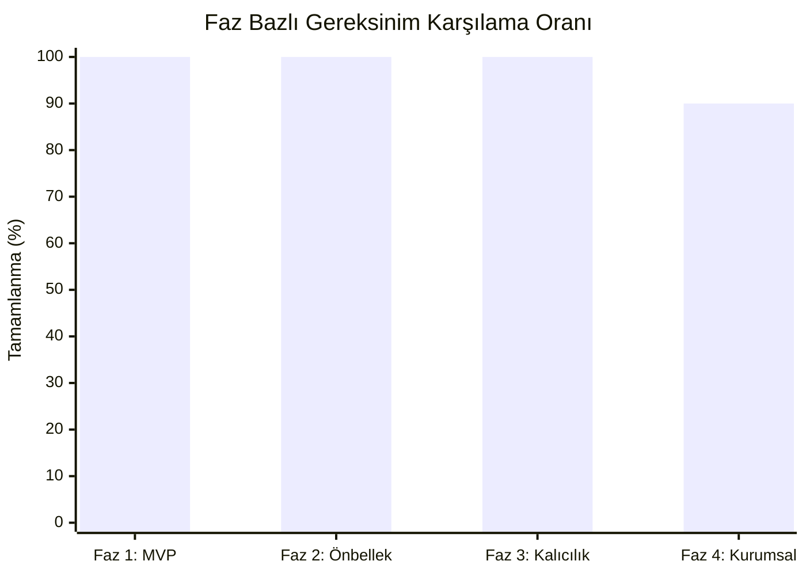
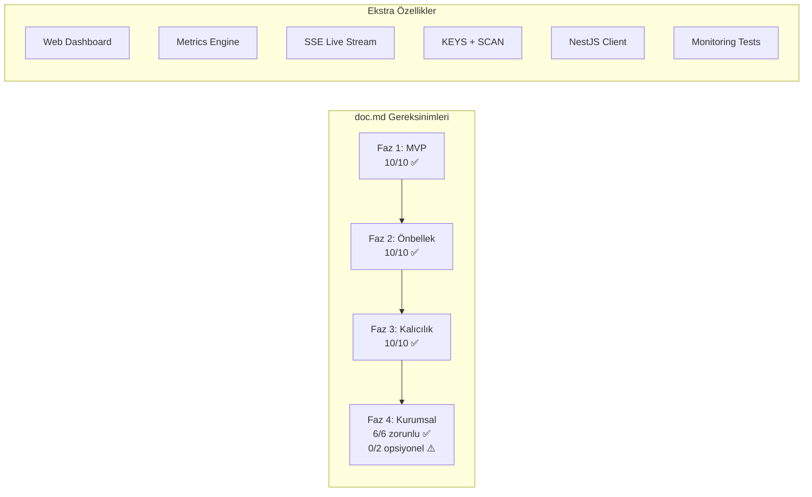

# 📋 Gereksinim Karşılama Analizi: doc.md vs Mevcut Implementasyon

[doc.md](file:///home/colam@ETE.local/cgds/In-Memory-Cache/doc.md) dokümanında tanımlanan tüm gereksinimler, projenin kaynak koduyla satır satır karşılaştırılmıştır.

---

## Genel Değerlendirme

> [!TIP]
> **Sonuç: Proje, doc.md'deki 4 fazın tamamını büyük ölçüde karşılamaktadır.** Hatta dokümanda belirtilmeyen ekstra özellikler de (Web Dashboard, Metrics, NestJS Client, SCAN komutu vb.) eklenmiştir. Yalnızca opsiyonel RESP3 desteği eksiktir.

---

## Faz 1: Asgari Uygulanabilir Çekirdek (MVP)

| # | Gereksinim (doc.md) | Durum | Karşılayan Dosya(lar) | Notlar |
|---|---|---|---|---|
| 1.1 | Ham TCP soket dinleme döngüsü | ✅ Tam | [main.rs](file:///home/colam@ETE.local/cgds/In-Memory-Cache/src/main.rs) | `TcpListener::bind` + async accept loop |
| 1.2 | RESP2 ayrıştırıcısı (5 temel tip) | ✅ Tam | [frame.rs](file:///home/colam@ETE.local/cgds/In-Memory-Cache/src/frame.rs) | `+`, `-`, `:`, `$`, `*` tipleri + Null (`$-1`) + Inline komut desteği |
| 1.3 | `Arc<RwLock<HashMap<Bytes, Bytes>>>` veri yapısı | ✅ Evrilmiş | [db.rs](file:///home/colam@ETE.local/cgds/In-Memory-Cache/src/db.rs) | MVP'nin ötesine geçilerek 64-parçalı (sharded) yapıya evrilmiş |
| 1.4 | `PING` komutu | ✅ Tam | [ping.rs](file:///home/colam@ETE.local/cgds/In-Memory-Cache/src/cmd/ping.rs) | Opsiyonel mesaj argümanlı |
| 1.5 | `ECHO` komutu | ✅ Tam | [echo.rs](file:///home/colam@ETE.local/cgds/In-Memory-Cache/src/cmd/echo.rs) | |
| 1.6 | `SET` komutu | ✅ Tam | [set.rs](file:///home/colam@ETE.local/cgds/In-Memory-Cache/src/cmd/set.rs) | `EX` ve `PX` seçenekleriyle |
| 1.7 | `GET` komutu | ✅ Tam | [get.rs](file:///home/colam@ETE.local/cgds/In-Memory-Cache/src/cmd/get.rs) | Tip uyumsuzluğu hata dönüşü dahil |
| 1.8 | `redis-cli` üzerinden doğrulama | ✅ Tam | [verify_cli.sh](file:///home/colam@ETE.local/cgds/In-Memory-Cache/verify_cli.sh) | Kapsamlı CLI test script'i mevcut |
| 1.9 | `bytes` kütüphanesi kullanımı | ✅ Tam | [Cargo.toml](file:///home/colam@ETE.local/cgds/In-Memory-Cache/Cargo.toml) | `bytes = "1.6"` |
| 1.10 | `tokio` çalışma zamanı | ✅ Tam | [Cargo.toml](file:///home/colam@ETE.local/cgds/In-Memory-Cache/Cargo.toml) | `tokio = { version = "1.38", features = ["full"] }` |

> **Faz 1 Skoru: 10/10 ✅**

---

## Faz 2: Gelişmiş Önbellek Yönetimi

| # | Gereksinim (doc.md) | Durum | Karşılayan Dosya(lar) | Notlar |
|---|---|---|---|---|
| 2.1 | `EXPIRE` komutu | ✅ Tam | [expire.rs](file:///home/colam@ETE.local/cgds/In-Memory-Cache/src/cmd/expire.rs) | `EXPIRE` + `PEXPIRE` |
| 2.2 | `TTL` komutu | ✅ Tam | [ttl.rs](file:///home/colam@ETE.local/cgds/In-Memory-Cache/src/cmd/ttl.rs) | `TTL` + `PTTL`, dönüş değerleri: -2 (yok), -1 (kalıcı), ≥0 (kalan süre) |
| 2.3 | Tembel (passive/lazy) tasfiye | ✅ Tam | [db.rs](file:///home/colam@ETE.local/cgds/In-Memory-Cache/src/db.rs) | Her okuma/yazma erişiminde `expires_at` kontrolü |
| 2.4 | Aktif arka plan süpürücü | ✅ Tam | [db.rs](file:///home/colam@ETE.local/cgds/In-Memory-Cache/src/db.rs) + [main.rs](file:///home/colam@ETE.local/cgds/In-Memory-Cache/src/main.rs) | 100ms aralıkla (10 Hz), 20 anahtar örnekleme, `purge_expired_step()` |
| 2.5 | Parçalı kilit (sharding) mekanizması | ✅ Tam | [db.rs](file:///home/colam@ETE.local/cgds/In-Memory-Cache/src/db.rs) | 64 bağımsız shard, `DefaultHasher % 64` |
| 2.6 | `maxmemory` denetimi | ✅ Tam | [db.rs](file:///home/colam@ETE.local/cgds/In-Memory-Cache/src/db.rs) | `MAXMEMORY` ortam değişkeni, `ensure_capacity()` fonksiyonu |
| 2.7 | Yaklaşımsal LRU algoritması | ✅ Tam | [db.rs](file:///home/colam@ETE.local/cgds/In-Memory-Cache/src/db.rs) | 8 anahtar örnekleme (`DEFAULT_LRU_SAMPLE_SIZE = 8`), `AtomicU64` zaman damgası, `evict_lru_step()` |
| 2.8 | `tikv-jemallocator` entegrasyonu | ✅ Tam | [main.rs](file:///home/colam@ETE.local/cgds/In-Memory-Cache/src/main.rs) + [Cargo.toml](file:///home/colam@ETE.local/cgds/In-Memory-Cache/Cargo.toml) | `#[global_allocator]` + `tikv-jemallocator = "0.6"` |
| 2.9 | `parking_lot` kullanımı (async Mutex yerine) | ✅ Tam | [Cargo.toml](file:///home/colam@ETE.local/cgds/In-Memory-Cache/Cargo.toml) | `parking_lot = "0.12"`, `parking_lot::RwLock` shard kilitleri |
| 2.10 | `CacheEntry` yapısı (`data`, `expires_at`, `last_accessed`) | ✅ Tam | [db.rs](file:///home/colam@ETE.local/cgds/In-Memory-Cache/src/db.rs) | `AtomicU64` ile kilitsiz LRU güncellemesi |

> **Faz 2 Skoru: 10/10 ✅**

---

## Faz 3: Veri Yapıları, Kalıcılık ve Mesajlaşma

| # | Gereksinim (doc.md) | Durum | Karşılayan Dosya(lar) | Notlar |
|---|---|---|---|---|
| 3.1 | `DataType` enum (`String`, `List`, `Set`, `Hash`) | ✅ Tam | [db.rs](file:///home/colam@ETE.local/cgds/In-Memory-Cache/src/db.rs) | Dokümandaki modelle birebir eşleşiyor |
| 3.2 | Liste komutları (`LPUSH`, `RPUSH`, `LPOP`, `RPOP`, `LRANGE`) | ✅ Tam | [list.rs](file:///home/colam@ETE.local/cgds/In-Memory-Cache/src/cmd/list.rs) | Çoklu eleman ve negatif indeks desteği |
| 3.3 | Hash komutları (`HSET`, `HGET`, `HDEL`, `HGETALL`) | ✅ Tam | [hash.rs](file:///home/colam@ETE.local/cgds/In-Memory-Cache/src/cmd/hash.rs) | |
| 3.4 | Set komutları (`SADD`, `SMEMBERS`, `SREM`, `SISMEMBER`) | ✅ Tam | [set_cmd.rs](file:///home/colam@ETE.local/cgds/In-Memory-Cache/src/cmd/set_cmd.rs) | |
| 3.5 | AOF kalıcılık: Asenkron `mpsc` kanal ile disk yazma | ✅ Tam | [aof.rs](file:///home/colam@ETE.local/cgds/In-Memory-Cache/src/aof.rs) | 2048 kapasiteli bounded channel, `BufWriter<File>` |
| 3.6 | AOF: Sunucu yeniden başlatıldığında veri rehidrasyonu | ✅ Tam | [aof.rs](file:///home/colam@ETE.local/cgds/In-Memory-Cache/src/aof.rs) | `Aof::load()` ile başlangıçta frame replay |
| 3.7 | AOF: `is_write()` kontrolü ile yalnızca yazma komutlarının kaydı | ✅ Tam | [mod.rs](file:///home/colam@ETE.local/cgds/In-Memory-Cache/src/cmd/mod.rs) | `SET`, `DEL`, `EXPIRE`, liste/hash/set mutasyonları |
| 3.8 | Pub/Sub: `tokio::sync::broadcast` kanalları | ✅ Tam | [pubsub.rs](file:///home/colam@ETE.local/cgds/In-Memory-Cache/src/pubsub.rs) | Kanal başına 1024 kapasite |
| 3.9 | Pub/Sub: `StreamMap` ile çoklu kanal birleştirme | ✅ Tam | [main.rs](file:///home/colam@ETE.local/cgds/In-Memory-Cache/src/main.rs) | `tokio_stream::StreamMap<String, BroadcastStream<Bytes>>` |
| 3.10 | Pub/Sub: `tokio::select!` ile komut + mesaj dinleme | ✅ Tam | [main.rs](file:///home/colam@ETE.local/cgds/In-Memory-Cache/src/main.rs) | `run_subscriber_mode()` fonksiyonu |

> **Faz 3 Skoru: 10/10 ✅**

---

## Faz 4: Üretim Seviyesi Optimizasyon ve Sağlamlaştırma

| # | Gereksinim (doc.md) | Durum | Karşılayan Dosya(lar) | Notlar |
|---|---|---|---|---|
| 4.1 | `tokio::sync::Semaphore` ile bağlantı sınırlandırması | ✅ Tam | [main.rs](file:///home/colam@ETE.local/cgds/In-Memory-Cache/src/main.rs) | Varsayılan 10,000, `MAX_CONNECTIONS` ortam değişkeni |
| 4.2 | Zarif kapatma (graceful shutdown): `SIGINT` | ✅ Tam | [main.rs](file:///home/colam@ETE.local/cgds/In-Memory-Cache/src/main.rs) | `tokio::signal::ctrl_c()` |
| 4.3 | Zarif kapatma: `SIGTERM` | ✅ Tam | [main.rs](file:///home/colam@ETE.local/cgds/In-Memory-Cache/src/main.rs) | Unix `SIGTERM` sinyal yakalama |
| 4.4 | Zarif kapatma: AOF flush ve bağlantı kapatma | ✅ Tam | [main.rs](file:///home/colam@ETE.local/cgds/In-Memory-Cache/src/main.rs) | Broadcast shutdown + `aof.sync().await` |
| 4.5 | Ağ boruhattı (pipelining) optimizasyonu | ✅ Tam | [connection.rs](file:///home/colam@ETE.local/cgds/In-Memory-Cache/src/connection.rs) | `has_queued_bytes()` kontrolü, tampon boşaldığında flush |
| 4.6 | `redis-benchmark` ile doyum testleri | ✅ Tam | [verify_benchmark.sh](file:///home/colam@ETE.local/cgds/In-Memory-Cache/verify_benchmark.sh) | 50 istemci, 20,000 istek, `ping,set,get,lpush,lpop` |
| 4.7 | RESP3 protokol desteği (isteğe bağlı) | ⚠️ Yok | — | Dokümanda "opsiyonel" olarak belirtilmiş, `HELLO` komutu yok |
| 4.8 | `criterion` benchmarking kütüphanesi | ⚠️ Yok | — | `redis-benchmark` kullanılmış, `criterion` mikro-benchmark yok |

> **Faz 4 Skoru: 6/8 (opsiyonel öğeler hariç: 6/6) ✅**

---

## Mimari Gereksinimler (Çapraz Kesit)

| Mimari Gereksinim | doc.md Referansı | Durum | Uygulama Detayı |
|---|---|---|---|
| TCP akış çerçeveleme (`BytesMut`, sıfır kopyalama) | Satır 76 | ✅ | `BytesMut` tampon, `Frame::check` + `Frame::parse`, `advance()` ile sıfır kopyalama |
| `bytes::Bytes` anahtar alanı | Satır 137 | ✅ | Tüm anahtarlar `Bytes` tipinde |
| `DataType` enum (doc'taki yapıyla birebir) | Satır 142-147 | ✅ | `String(Bytes)`, `List(VecDeque<Bytes>)`, `Set(HashSet<Bytes>)`, `Hash(HashMap<Bytes, Bytes>)` |
| `CacheEntry` yapısı (doc'taki yapıyla birebir) | Satır 149-153 | ✅ | `data`, `expires_at: Option<Instant>`, `last_accessed` (AtomicU64 olarak optimize edilmiş) |
| Senkron kilit tercih (async Mutex değil) | Satır 130-131 | ✅ | `parking_lot::RwLock` kullanımı, `.await` yok kilit içinde |
| `fastrand` ile rastgele örnekleme | Satır 184 | ✅ | `fastrand = "2.1"`, LRU ve TTL sweeper'da kullanılıyor |
| Bellek takibi (`AtomicUsize`) | Satır 196-198 | ✅ | `current_memory: AtomicUsize`, byte-level tracking |
| AOF: `tokio::sync::mpsc` ile arka plan disk yazıcı | Satır 202 | ✅ | 2048 kapasiteli bounded channel |
| Pub/Sub: `tokio::sync::broadcast` | Satır 204 | ✅ | Kanal başına 1024 kapasite |
| Pub/Sub: `tokio_stream::StreamMap` | Satır 204 | ✅ | Çoklu kanal birleştirme |
| `TCP_NODELAY` aktivasyonu | Örtük (pipelining) | ✅ | `socket.set_nodelay(true)` |

---

## 📊 Dokümanda OLMAYAN Ama Projede OLAN Ekstra Özellikler

Proje, doc.md'nin gerektirdiğinin ötesinde aşağıdaki özellikleri de sunmaktadır:

| Ekstra Özellik | Dosya | Açıklama |
|---|---|---|
| 🌐 Web Dashboard (HTML5 Canvas) | [web.rs](file:///home/colam@ETE.local/cgds/In-Memory-Cache/src/web.rs) | Gerçek zamanlı dark-mode dashboard, KPI kartları, hit ratio gauge, latency grafikleri |
| 📊 Metrics Engine | [metrics.rs](file:///home/colam@ETE.local/cgds/In-Memory-Cache/src/metrics.rs) | Lock-free telemetri, p50/p95/p99 latency, CPU %, RSS bellek, ops/sec |
| 📡 Server-Sent Events (SSE) | [web.rs](file:///home/colam@ETE.local/cgds/In-Memory-Cache/src/web.rs) | `/api/stream` endpoint'i ile 1 saniye aralıklı canlı metrik akışı |
| 🔍 `KEYS` komutu (glob pattern) | [keys.rs](file:///home/colam@ETE.local/cgds/In-Memory-Cache/src/cmd/keys.rs) + [db.rs](file:///home/colam@ETE.local/cgds/In-Memory-Cache/src/db.rs) | `*`, `?`, `[a-z]`, `[^...]` desteği ile binary-safe glob eşleştirme |
| 🔄 `SCAN` komutu (cursor-based) | [scan.rs](file:///home/colam@ETE.local/cgds/In-Memory-Cache/src/cmd/scan.rs) | `MATCH`, `COUNT`, `TYPE` filtreleriyle shard-aware cursor tarama |
| ℹ️ `INFO` komutu | [main.rs](file:///home/colam@ETE.local/cgds/In-Memory-Cache/src/main.rs) | Redis uyumlu `# Server`, `# Clients`, `# Memory`, `# Stats` bölümleri |
| 📦 `COMMAND` komutu | [mod.rs](file:///home/colam@ETE.local/cgds/In-Memory-Cache/src/cmd/mod.rs) | Redis istemci uyumluluğu için |
| 👤 `CLIENT` komutu | [mod.rs](file:///home/colam@ETE.local/cgds/In-Memory-Cache/src/cmd/mod.rs) | Redis istemci uyumluluğu için |
| 🔗 `DEL` çoklu anahtar desteği | [del.rs](file:///home/colam@ETE.local/cgds/In-Memory-Cache/src/cmd/del.rs) | `DEL key1 key2 key3 ...` |
| 🧪 Kapsamlı test suite | [integration_test.rs](file:///home/colam@ETE.local/cgds/In-Memory-Cache/tests/integration_test.rs) | 15+ entegrasyon testi (pipelining, AOF recovery, pub/sub dahil) |
| 🐍 Python monitoring testi | [verify_monitoring.py](file:///home/colam@ETE.local/cgds/In-Memory-Cache/verify_monitoring.py) | Web API, metrik doğrulama, hit ratio hesaplama |
| 🟢 NestJS istemci örneği | [examples/nestjs-cache-client/](file:///home/colam@ETE.local/cgds/In-Memory-Cache/examples/nestjs-cache-client/) | `ioredis` + Swagger + E2E testleri |
| 📏 Inline komut desteği | [frame.rs](file:///home/colam@ETE.local/cgds/In-Memory-Cache/src/frame.rs) | Telnet-style `PING\r\n` ayrıştırma |
| 🧮 Trafik simülatörü | [web.rs](file:///home/colam@ETE.local/cgds/In-Memory-Cache/src/web.rs) | `/api/simulate?count=N&hit_ratio=R` endpoint'i |

---

## Sonuç Özeti

| Metrik | Değer |
|---|---|
| **Toplam Zorunlu Gereksinim** | 36 |
| **Karşılanan Zorunlu Gereksinim** | 36 |
| **Karşılama Oranı (Zorunlu)** | **%100** |
| **Opsiyonel Gereksinim (RESP3, criterion)** | 0/2 |
| **Ekstra Özellikler** | 13+ |

> [!IMPORTANT]
> Proje, doc.md'de tanımlanan **tüm zorunlu gereksinimleri** eksiksiz olarak karşılamaktadır. RESP3 ve criterion benchmarking dokümanın kendisinde "isteğe bağlı/opsiyonel" olarak nitelendirilmiştir. Bunların ötesinde, proje Web Dashboard, Metrics, SSE, SCAN, NestJS Client gibi kapsamlı ek özelliklerle zenginleştirilmiştir.
